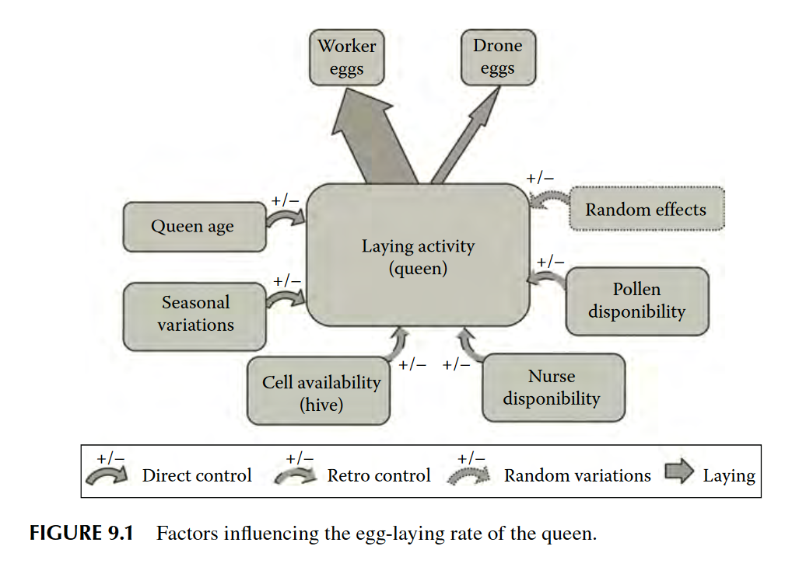
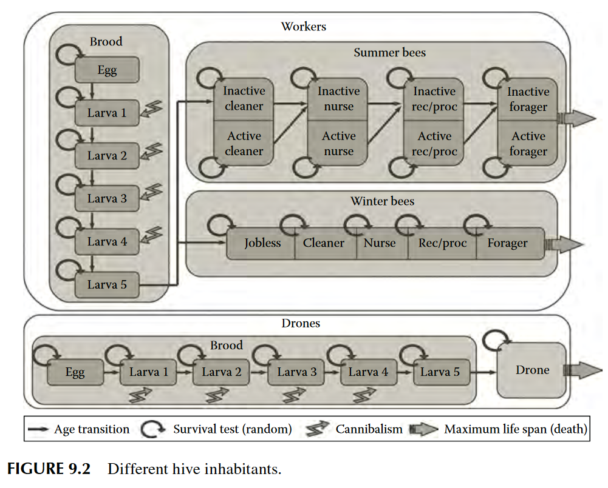

# SimBeeBop
| Ref | `n_parameters` | Primary language | Environment | Agents |
|-----|----------------|------------------|-------------|--------|
| In silico bees (ch. 9) | 145 | Java | Dadant hive | All hive inhabitants |

## Parameters
- 113 parameters characterize the structure and the properties of the agents and the environment. 
- 27 parameters allow modulations of different agent properties. (e.g. application of “perturbations”). 
- 5 parameters optimize memory allocation.

## Figures

